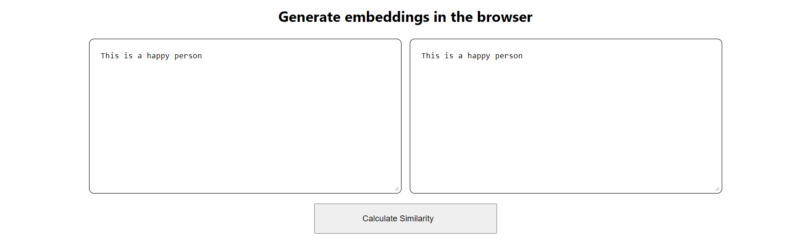

# Embeddings in React

A web app that uses [Transformers.js](https://huggingface.co/docs/transformers.js/index) to compare the similarity between two sentences or paragraphs.

## Installing

Clone from github then install the dependencies from yarn: `yarn install`

## Running

Run with `yarn start`
